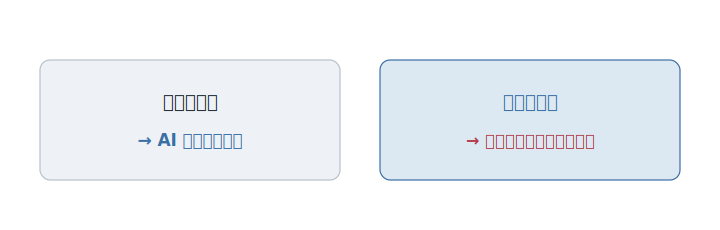

# 終章 AI は「当たり前」を作れるのか

ここまで、九つの物語を見てきた。

形は、どれも同じだった。まず、困りごとがあった。誰かが、本気の答えを出した。その答えは、やがて失敗した。新しい考えが生まれ、人々が言い争い、少しずつ直された。そして、いつのまにか「当たり前」になった。終わったように見えて、その先には、また次の困りごとが待っていた。

問題、答え、失敗、議論、改善、文化。この六つが、百年のあいだ、何度も繰り返されてきた。プログラマーが「そう考える」ようになった理由は、結局、これだった。**誰かが不自由に気づき、本気で間違え、それでも前へ進もうとし続けたから**だ。

---

さて、ここで、新しい書き手が現れた。

コードを、人と同じように、いや、人より速く書く存在。AI だ。あなたが今、まさにこの本を手に取っているこの時代に、それは、プログラマーの隣に座っている。

では、問わなければならない。**この営みを、AI は引き受けられるのか。**

ここで、[第7章](part4/chapter7.md)の区別が物を言う。閉じた問いと、開いた問いだ。

閉じた問い――すでに決着がついて、なぜそうなのかを語れる問い。その答えなら、AI は見事に再現する。世界中の「当たり前」を学び、最も標準的なやり方を、瞬時に差し出す。シンプルに書くことも、テストを書くことも、良い名前をつけることも、AI はもう、たいていの新人より上手にこなす。

だが、この本で見てきたのは、**閉じた問いの答えだけではなかった。**

---

思い出してほしい。それぞれの章は、決着のついた答えで終わらなかった。最後は必ず、まだ開いている問いへと続いていた。

大きく作るか、小さく割るか。どこまで設計を先に決めるか。どこまでを機械に任せるか。どんな価値観の言語が良いか。Web は、どこまで重くなっていいのか。――どれも、誰もまだ答えを出していない。

そして、もっと大事なことがある。**この本に出てきた「当たり前」は、最初はどれも、開いた問いだった。** 複雑さとの戦い方も、テストの意味も、自由なソフトの価値も、生まれた当初は、答えのない問いだった。誰かが、まだ答えのない場所で、本気で間違え、議論し、文化に変えた。だから今、それは閉じた問いになっている。

AI が再現できるのは、その**結果**だ。誰かが命がけで開き、戦い、閉じてくれた、その後の答えだ。

<figure>

<figcaption><strong>図 e-1</strong>　AI が差し出すのは、閉じた後の答えだ。</figcaption>
</figure>

では、まだ開いている問いを引き受けることは、どうだろう。答えのない場所で立ち止まり、選ぶ責任から逃げず、盛大に間違え、その失敗を恥ではなく次の文化に変えていくこと。**自由を、勝ち取り、更新し続けること。** ――それは、AI にできるのか。それとも、それは最後まで、人の仕事として残るのか。

正直に言えば、この問いも、開いている。今、答えを断言できる人は、いない。

---

ただ、一つだけ、確かなことがある。

この本を読み終えたあなたは、もう、外から眺める人ではない。

プログラマーが「なぜそう考えるのか」を、あなたはもう知っている。それは、暗記すべきルールではなく、不自由と戦った人たちの、生きた選択の積み重ねだった。そして、その物語は、まだ閉じていない。次の不自由に気づき、次の「当たり前」を作る列に、あなたは、もう並んでいる。

AI は、コードを書く。おそらく、これからもっと上手に書く。

だが、自由は――まだ誰も答えを出していない問いを引き受け、選び続け、失敗を文化に変えていく、あの営みは――あなたと AI の、どちらが作るのだろうか。

その答えを書くのは、この本ではない。

これから、あなただ。
