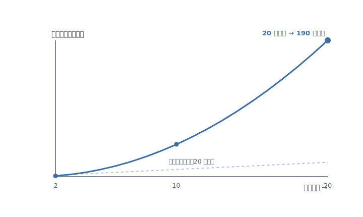
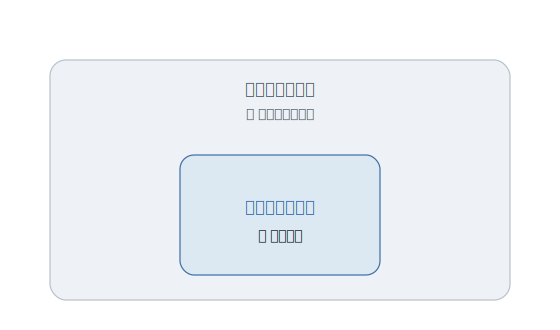
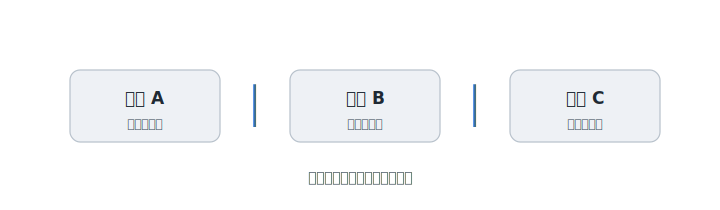

# 第1章 機能を増やそうと言ったら、止められた

「便利だから、この機能も入れましょう」

あなたは、よかれと思って言った。ユーザーが喜ぶ。手間も省ける。足して困ることなんて、あるだろうか。

なのに、先輩は浮かない顔をする。

「……うーん。それ、本当に要りますか」

要るに決まっている。便利なのだから。なぜ、足すことを、こんなに渋るのか。

この渋い顔の裏には、百年ぶんの経験が畳み込まれている。そして、その経験が教えるのは、たいてい同じことだ。

**足すのは一瞬。抱えるのは、一生。**

---

ソフトウェアには、不思議な性質がある。

機能を一つ足すたび、増えるのは「一つ」では済まない。新しい機能は、すでにある機能と手をつなぐ。組み合わせが、かけ算で膨れていく。十の機能が二十になると、気を配るべき関係は、その倍では済まない数になる。

<figure>

<figcaption><strong>図 1-1</strong>　足すのは一つ。増える関係は、一つでは済まない。</figcaption>
</figure>

やがて、誰も全体を見渡せなくなる。ここを直すと、あそこが壊れる。なぜ壊れたのか、誰にもわからない。作ったはずの自分たちが、自分たちの作ったものに振り回されはじめる。

これが、プログラマーをずっと苦しめてきた、最初の不自由だ。**複雑さに、飲み込まれる。**

---

最初に人類が選んだ答えは、勇ましかった。複雑さに、力で勝とうとしたのだ。

もっと賢い言語を。もっと万能な設計図を。複雑さを一撃で消し去る、特別な道具がきっとあるはずだ――その夢に、時代の最良の頭脳がつぎ込まれた。

日本も、国を挙げてその夢を見た。第五世代コンピュータ。論理を突き詰めれば、機械は人のように考えはじめる。膨大な予算と、当時の一流が集まった。本気だった。誰も、笑ってなどいなかった。

だが、特別な道具は、来なかった。

その壮大な目標は、思い描いた形では実らない。そして同じころ、フレデリック・ブルックス――巨大なソフトウェア開発の難しさを、誰より知る技術者だ――が、静かに、しかし決定的なことを書く。

**銀の弾丸は、ない。**

彼が言ったのは、こういうことだ。ソフトの複雑さには二種類ある。たまたま今の道具が未熟なせいで生じる複雑さと、解こうとしている問題そのものが、本質的に抱えている複雑さ。前者は、よい道具で減らせる。だが後者は、どんな魔法の道具を持ってきても、消えない。複雑さは、退治すべき敵ではなく、問題の一部なのだ。

<figure>

<figcaption><strong>図 1-2</strong>　複雑さは二種類ある。外側は道具で減らせるが、内側の本質は消えない。</figcaption>
</figure>

力で勝とうとした時代は、こうして静かに終わる。

---

勝てないなら、どうするか。

ベル研究所の片隅で、まったく別の答えが育っていた。複雑さを倒すのをあきらめて、**小さく分ける。**

ダグ・マキルロイ――UNIX という土壌を耕した一人だ――は、こう考えた。一つのことだけを、うまくやるプログラムを書く。そして、それらを組み合わせて使う。大きな一つではなく、小さな多数を。

それを象徴するのが、パイプという仕組みだ。小さな道具の出口を、次の道具の入口へ、縦棒一本でつなぐ。一つ一つは単純なのに、つなぐと複雑な仕事をやってのける。複雑さを、一個の頭で抱え込むのではなく、小さな部品に分けて預けてしまう。

<figure>

<figcaption><strong>図 1-3</strong>　一つのことだけをやる道具を、縦棒一本でつなぐ。小さな部品の連結が、大きな仕事になる。</figcaption>
</figure>

この「分けて手なずける」という発想は、その後、いろいろな現場から少しずつ言葉を与えられていった。出どころは、ばらばらだ。航空機の整備の現場からは、単純に保て（KISS）。経験を積んだ職人たちからは、同じことを二度書くな（DRY）。変化の速い開発の現場からは、いま要らないものは作るな（YAGNI）。

誰か一人の英雄が、上から決めたのではない。別々の場所で、別々の人が、同じ壁にぶつかり、似た知恵を持ち帰った。それらが寄り集まって、いつのまにか「当たり前」になった。

---

だから今、ベテランは、機能を足す前に一度、立ち止まる。

足すこと自体が悪いのではない。足したぶんだけ、全体が見渡せなくなる――その代償が見えているから、あの渋い顔になるのだ。

ただし、ここでよくある誤解を、ひとつ解いておきたい。

「いま要らないものは作るな」は、「先のことを一切考えるな」ではない。将来の変更に備えて余白を残すことと、来るかどうかもわからない機能を先回りで作り込むことは、まったく別だ。「同じことを二度書くな」も、「何でも一つにまとめろ」ではない。たまたま今だけ形が似ているコードを無理にひとつにすると、後でかえって、ほどけなくなる。

面白いのは、これらの誤解そのものが、小さな「銀の弾丸探し」だということだ。一つの原則を万能の魔法だと思い込んだ瞬間、人はまた、複雑さに足をすくわれる。

---

そして、この戦いは、今も終わっていない。

「大きな一つより、小さな多数を」。この教えを推し進めると、ひとつのアプリを、たくさんの小さなサービスに割っていく考え方になる。分ければ分けるほど身軽になる――はずだった。だが、分けすぎると、今度は部品と部品のあいだが複雑になる。複雑さは、結局どこかで、姿を変えて戻ってくる。

大きく作るか、小さく割るか。これは、まだ誰も最終的な答えを出していない、開いたままの問いだ。

---

それでも、百年かけてプログラマーが学んだことが、ひとつだけある。

複雑さは、力で消すものではない。小さく分けて、手なずけるものだ。なぜ、わざわざそうするのか。明日も、半年後も、このソフトに手を入れ続けられるように、だ。

**シンプルさとは、複雑さに飲まれず、手を入れ続けられる――という自由だ。**

ただし、複雑さを分けただけでは、まだ足りない。

分けたその一つ一つが、読めなければ。半年後のあなたが、それを開いて「これは、何だ」とつぶやくなら、結局あなたは、また手を出せなくなる。

複雑さの次に立ちはだかるのは、**読めなさ**という、もうひとつの不自由だ。

その話は、次の章で。
