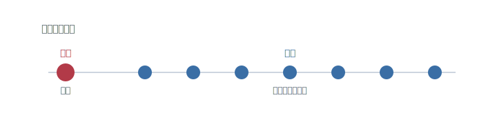
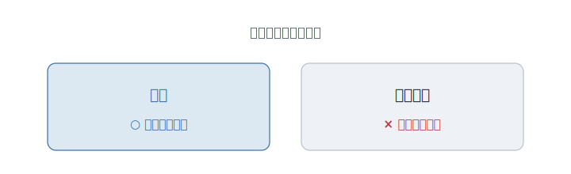
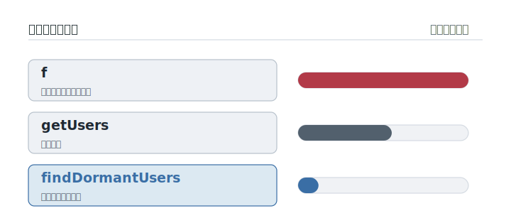

# 第2章 コードは、誰のために書くのか

レビューが返ってきた。

ロジックは、どこも直されていない。動きは、何も変わっていない。直されたのは、ただ一つ――変数の名前だけだった。

`tmp` が、`unpaidInvoices` に変わっている。

それだけ。たったそれだけのことに、先輩はわざわざ一言を添えている。「動くんですけど、これだと半年後に読めないので」。

動く。なのに、読めない。その二つは、両立するのか。

---

ソフトウェアには、見落とされがちな事実がある。コードは、書かれる回数より、**読まれる回数のほうがずっと多い。**

<figure>

<figcaption><strong>図 2-1</strong>　書くのは一度。読まれるのは、そのあと何度も、ずっと。</figcaption>
</figure>

一度書いたコードを、人はそのあと何度も読み返す。直すために読む。機能を足すために読む。なぜ壊れたのかを探すために読む。書くのは一瞬でも、読むのは、そのソフトが生きているあいだ、ずっと続く。

そして、その読み手は、たいてい未来の自分だ。半年もすれば、なぜそう書いたのか、きれいさっぱり忘れている。**半年後の自分は、他人だ。** その他人が、何も思い出せないまま、あなたの書いた数行の前に立つ。

ここで、前の章の続きに気づく。複雑さを、小さく分けた。だが、分けた一つ一つが読めなければ、結局あなたは、また手を出せなくなる。分けることと、読めること。その二つがそろって、はじめて手を入れ続けられる。

読めなさ。これが、プログラマーを縛ってきた、もうひとつの不自由だ。

---

最初の答えは、親切だった。読みにくいなら、説明すればいい。**コメントを書こう。**

コードの脇に、人間の言葉で注釈を添える。この行は何をしているか。この変数は何を表すか。一行ごとに、ていねいに語る。かつて、読みやすさとは「コメントの量」のことだと、半ば本気で信じられた時代があった。手厚いほど親切だ、と。

---

だが、コメントには、ひとつ弱点がある。**機械は、コメントを読まない。**

機械が動かすのは、コードのほうだ。コメントは、ただの添え物として、素通りされる。だから、コードを直してもコメントはそのまま取り残される。書いた本人は、注釈まで直す義務を、機械から課されていない。

こうして、コメントは少しずつ、コードと食い違っていく。やがて、コードは右へ行けと言っているのに、コメントは左を指している、という事態が起きる。

間違ったコメントは、ない方がましだ。なにしろ、自信たっぷりに、間違った道を教えてくるのだから。手厚く書けば書くほど、腐ったときの嘘は増えていく。親切のつもりが、いちばん質の悪い罠になる。

---

ならば、どうするか。注釈で外から補うのをやめて、**コード自体を、読めるものにする。**

ドナルド・クヌース――組版から教科書まで手がけた、計算機科学の巨人だ――は、こう言い換えてみせた。プログラムを書く仕事を、「機械に命令する作業」だと思うのはやめよう。「人間に、何をさせたいかを説明する作業」だと考え直そう、と。

同じころ、ある教科書の冒頭に、のちのち何度も引かれる一文が置かれる。**プログラムは、人間が読むために書かれる。機械が実行するのは、ついでにすぎない。**

そして、マーティン・ファウラー――変更に強いコードの作法を、現場の言葉で広めた一人だ――は、もっと端的に言った。**機械にわかるコードなら、誰でも書ける。人間にわかるコードを書けるのが、よいプログラマーだ。**

ここで、梃子になるのが「名前」だ。

なぜ、コメントではなく名前なのか。理由ははっきりしている。名前は、コメントと違って、**コードの一部**だからだ。機械が実際に使う。だから、嘘をつけない。名前を変えれば、その名を呼んでいる場所すべてが、いやおうなく変わる。放っておいても、コードと食い違いようがない。コメントは添え物だから腐る。名前は本体だから、腐れない。

<figure>

<figcaption><strong>図 2-3</strong>　コメントは添え物だから、いつか食い違う。名前は本体だから、食い違いようがない。</figcaption>
</figure>

---

ここで、少し手を動かしてみてほしい。

三十日ログインのないユーザーを集めて返すだけの、数行の処理がある。これに、名前をつける。三通り、並べてみる。

- `f` ……何も言っていない。中を全部読むまで、何をするのかわからない。
- `getUsers` ……「ユーザーを取ってくる」ことはわかる。だが、どのユーザーかは言っていない。結局、中を読むことになる。
- `findDormantUsers`（休眠ユーザーを探す）……中を開く前に、答えを返している。「ああ、しばらく使っていない人を探すのか」と。

半年後のあなたが、まっさらな頭で、このどれかと出会う。どれと出会いたいだろうか。

<figure>

<figcaption><strong>図 2-2</strong>　名前が語るほど、中を開かずに済む。</figcaption>
</figure>

三番目の名前は、本来ならコメントが引き受けるはずだった説明を、自分で済ませている。しかも、コメントと違って腐らない。処理の中身が変われば、名前も直さざるをえないからだ。名前は、最も短く、最も嘘をつかないコメントだと言ってもいい。

---

だから今は、読みにくいと感じたとき、コメントを足す前に、まず名前を疑う。

ここで、よくある誤解を解いておきたい。「コメントを書けば、読みやすくなる」――これは、半分しか正しくない。

読みにくいコードにコメントを貼るのは、傷に絆創膏を重ねるようなものだ。`tmp` に「これは未払いの請求書です」と注釈するくらいなら、はじめから `unpaidInvoices` と名づければいい。コメントが要るのは、名前では言えないことを残すときだけだ。「なぜ」この一見おかしいやり方を選んだのか。なぜ、あえて遠回りをしたのか。その理由は、コードを見ても出てこないから、書き添える価値がある。

つまり、「何を」しているかは、名前とコードが語る。「なぜ」そうしたかは、コメントが語る。この線引きを取り違えて、「何を」までコメントで説明しはじめた瞬間、腐るコメントの山が育ちはじめる。

---

では、よい名前とは何か。そこから先は、まだ誰も決着をつけていない。

`camelCase` か `snake_case` か。英語で書くか、業務で使う言葉で書くか。短く済ませるか、長くても明確を取るか。チームごと、言語ごとに、今も議論は続いている。

ただ、一つだけ、疑いようがない。名前は、機械のためではなく、次に読む人間のためにつける。

---

そろそろ、最初の問いに答えられる。コードは、誰のために書くのか。

機械は、どんな名前でも動かす。`tmp` でも `a1` でも、文句ひとつ言わない。名前に意味を求めるのは、ただ一人――いつかこのコードを開く、人間だけだ。

その人は、半年後のあなたかもしれないし、まだ会ったことのない誰かかもしれない。名前をつけるとき、あなたは、その人に向かって書いている。

**名前をつけるとは、まだ見ぬ読み手に、理解する自由を贈ることだ。**

---

読めるコードができた。あなたは、半年後も、その中身をたどれる。

だが、半年のあいだに変わるのは、あなたの記憶だけではない。

「やっぱり、こうしたい」と、お客さんが言う。きれいに名づけ、きれいに分けたはずのコードに、最初は思ってもみなかった要求が、ぶつかってくる。

どうせ、仕様は変わる。その前提に、どう備えるのか。

その話は、次の章で。
