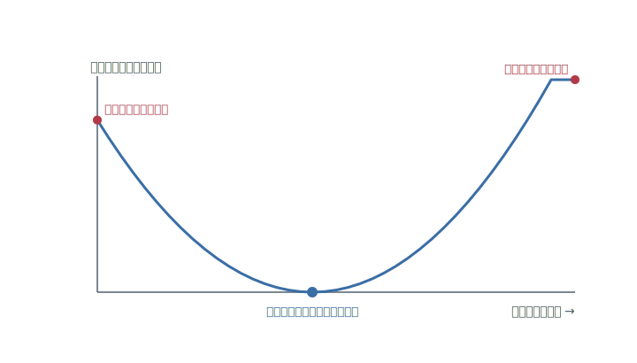
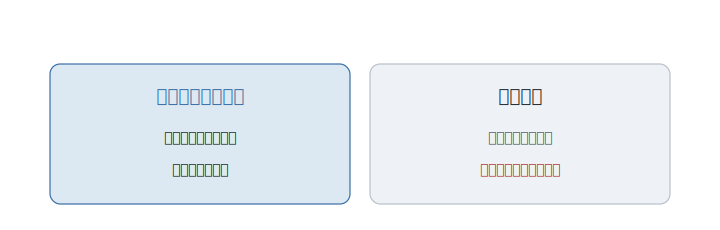

# 第3章 どうせ仕様は変わる

仕様が、変わった。

先週、「これでいきましょう」と決めたはずだった。なのに、お客さんは悪びれずに言う。「やっぱり、こうしたいんです」。

あなたは、青ざめる。あの設計は、この要求を、まったく想定していない。きれいに組んだはずの段取りが、根元から合わなくなる。一から作り直しか――。

ところが、先輩は慌てない。お茶を一口飲んで、こう言うだけだ。

「まあ、変わりますよね。仕様って」

なぜ、こんなに落ち着いていられるのか。変わって困らない作り方を、この人は知っているらしい。

---

ソフトウェアづくりには、逃げられない現実がある。**作りはじめる前に、すべてを正しく決めることは、できない。**

人は、使えるものを目の前にして、はじめて「本当に欲しかったもの」に気づく。だから、動くものを見せたとたん、要求は動く。市場も、法律も、競合も動く。決めた前提は、決めたそばから古くなっていく。

これが、プログラマーを縛ってきた、次の不自由だ。**最初に固めると、あとで動けない。**

---

最初の答えは、いっそ潔かった。変わるのが困るなら、**変わる前に、すべてを決めきってしまえばいい。**

まず、完璧な設計図を描く。あらゆる場合を先回りして、隅々まで紙の上で固める。図さえ完成すれば、あとはそのとおりに組み立てるだけ――そう考えた。

1970 年代から 1990 年代にかけて、この夢は本気で追いかけられた。図を描けば、そこからプログラムが自動で生み出される。そんな道具に、巨額が投じられた。設計を図として記述する記法も整えられ、「この図を描ききれば、設計は終わる」と信じられた。手を動かして作るより、上流で考えきるほうが偉い、という空気さえあった。

---

だが、現実は、その夢をやすやすと裏切った。

完璧なはずの図は、最初の仕様変更ひとつで、ただの古い絵になった。図とコードは、別々に育っていく。直すのはいつもコードのほうで、図は放置され、やがて誰も信じなくなる。図から自動で完璧なコードが湧く、という道具も、約束したものを届けられなかった。

わかったのは、こういうことだ。**図は、設計そのものではない。** それは、人と人が設計を話し合うための、会話の道具にすぎない。会話の道具を、未来を固定する契約書だと取り違えたところに、無理があった。

決めきろうとすればするほど、変化が来たときの痛手は大きくなる。固めた量だけ、動けなくなるのだ。

<figure>

<figcaption><strong>図 3-1</strong>　決めなさすぎても、決めすぎても、変化は痛い。</figcaption>
</figure>

---

1990 年代後半、発想をまるごとひっくり返した人がいる。**ケント・ベック（Kent Beck）。**

彼が言ったのは、こうだ。変化は、避けるべき事故ではない。**最初から、そこにある前提だ。** ならば、変化が来ないことに賭けるのをやめよう。来たときに、安く変えられるように作ろう。彼はそれを、強い言葉で掲げた。**変化を、抱きしめろ。**

考え方が逆なのだ。これまでは、変えずに済むように、最初にすべてを固めた。ベックは、いつでも変えられるように、あえて固めすぎない、と言う。

この発想は、彼ひとりのものではなかった。ウォード・カニンガム（Ward Cunningham）――まだ手を入れやすいうちに直さず放置したコードを、利子のつく「借金」にたとえた人だ――は、設計の先送りには代償が積み上がると説いた。マーティン・ファウラー（Martin Fowler）は、その手入れの作法を整理した。動いているコードの、**外から見た動きはそのままに、内側の形だけを整える**。この小さく安全な手直しを、彼らは一つの技術として確立した。

やがて、同じ考えを持った人たちが集まり、短い宣言を書き残す。**計画に従うことよりも、変化に対応することを。** 一人の英雄が決めたのではない。変化に何度も殴られた者たちが、別々の現場で同じ結論にたどり着き、それを言葉にしたのだ。

---

だから今、慣れたプログラマーは、仕様が変わっても青ざめない。最初から、変わる前提で作っているからだ。

一つ、混同されやすいことがある。いま言った「内側の形を整える」手直し――リファクタリングは、**「作り直し」ではない。**

作り直しは、いったん壊して、ゼロから組み直すことだ。動きが変わるかもしれないし、新しいバグも生まれる。大きな賭けになる。リファクタリングは、その正反対だ。**動きは、一ミリも変えない。** 名前を直し、絡んだ部分をほどき、形だけをきれいにする。外から見れば、何も変わっていない。だが内側は、次の変更を受け入れやすくなっている。

<figure>

<figcaption><strong>図 3-2</strong>　リファクタリングは外の動きを変えず、内側だけ整える。作り直しとは、そこが違う。</figcaption>
</figure>

この二つを混同して、「リファクタリングします」と言いながらゼロから作り直しはじめると、たいてい火を噴く。動きを変えない、という一点こそが、この手入れを安全にしている。

---

では、設計は、どこまで先に決めておくべきなのか。そこから先は、まだ誰も決着をつけていない。

何も決めずに走りだせば、行き当たりばったりで迷子になる。決めすぎれば、変化で動けなくなる。前もって設計する量を、どこに置くか。その目盛りは、チームごと、プロジェクトごとに、今も探り続けられている。

ただ、向きだけは、もう定まっている。すべてを先に決めることは、できない。そして、決めきれないことは、弱さではない。

---

あの、お茶を飲む先輩に戻ろう。なぜ、仕様が変わっても動じないのか。

変わらないように身構えるのをやめて、変わってもいいように作っているからだ。決めるべきことは決め、決めきれないことは、決めきれないまま、手を入れられる形で残しておく。

**設計とは、最初にすべてを決めなくていい――という自由だ。**

ケント・ベック（Kent Beck）、ウォード・カニンガム（Ward Cunningham）、マーティン・ファウラー（Martin Fowler）が言葉にしたのは、変化を避けるのでなく、変化に耐える作り方だった。とくにリファクタリングは、外から見た動きを変えずに内側を整えることだと押さえておくと、作り直しとの違いを取り違えにくい。ここを誤解なく辿るなら、付録の用語集でアジャイルとリファクタリングを見てから、Beck と Fowler の本に進むのがいい。

変わってもいいように作る。言うのは簡単だ。

だが、いざコードの内側を直すたび、心配になる。この手入れで、どこか遠くを、静かに壊してはいないか。動きは変えていないつもりだ。けれど、「つもり」を、誰が保証してくれるのか。

完成したはずのコードに、それでも手を入れ続けるための、もう一つの備えがいる。

その話は、[次の章](chapter4.md)で。

## 参考文献

- [Kent Beck, *Extreme Programming Explained*](https://www.informit.com/store/extreme-programming-explained-embrace-change-9780321278654)
- [Martin Fowler, *Refactoring*](https://martinfowler.com/books/refactoring.html)
- [Ward Cunningham, "The WyCash Portfolio Management System"](https://c2.com/doc/oopsla89/paper.html)
