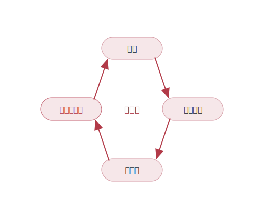
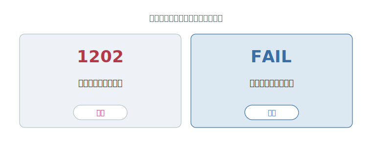
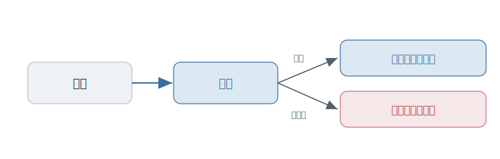

# 第4章 完成したはずなのに、まだテストを書く

あなたが書いたコードは、動いている。

レビューに出す。返ってきたのは、こんな言葉だ。

「ここは、触らないほうがいいですね」

意味が、最初はわからない。動いているのに。直したい場所が、目の前にあるのに。なぜ、触ってはいけないのか。

実はこの章には、ひとりの主人公がいる。人ではない。<strong>「動いているのに、誰も触れないコード」</strong>だ。これから話すことは全部、その一点の恐怖をめぐっている。

---

プログラマーは、ずっとこの恐怖と暮らしてきた。

かつて、ソフトウェアをリリースするということは、半分、祈ることだった。手元では動いた。だから出す。あとは、壊れていませんように、と願う。実際、よく壊れた。しかも厄介なのは、直した場所ではなく、まったく関係のない遠くが壊れることだった。一行直すと、半年前に書いた別の機能が、静かに死ぬ。誰も全体を確かめられない。

ある時期、技術者たちは、ある言葉を口にしはじめる。**ソフトウェア危機。** ハードウェアは年々速く、安くなっていくのに、それを動かすソフトだけが、大きくなるほど手に負えなくなっていく。作れるはずのものが、作れない。直せるはずのものが、直せない。業界全体が、「自分たちはソフトの作り方をまだ知らない」と認めた瞬間だった。

恐怖が現実になった例には、事欠かない。

あるロケットは、前の機体で何年も正しく動いていたプログラムを、ほぼそのまま新しい機体に積んだ。古い機体では決して起こらなかった計算上のあふれが、より速く飛ぶ新しい機体では起きた。誰も、そこを確かめていなかった。例外は誰にも受け止められず、装置は自ら停止し、機体は打ち上げから一分足らずで、自分を破壊した。

**動いていたコードは、文脈が変わった瞬間に牙をむく。** これが、恐怖の正体だ。

---

最初の答えは、素朴だった。人間が、頑張って確かめる。

リリースの前に、手で一通り動かす。専門の担当者を立てて、画面を端から端まで叩いてもらう。徹夜の総点検。問題があれば、見つかる。たぶん。

けれど、これは規模に負ける。機能が二つなら、組み合わせは数えられる。十、二十と増えていけば、確かめるべき道筋は、人間の手に負えない数に膨れ上がる。どれだけ丁寧に総点検しても、確かめきれない一点が必ず残る。

そして恐怖は、こうして悪化する。怖いから、触らない。触らないから、古びる。古びるから、もっと怖くなる。

<figure>

<figcaption><strong>図 4-2</strong>　怖いから触らない。触らないから古びる。古びるから、もっと怖くなる。恐怖は一周するたびに濃くなる。</figcaption>
</figure>

---

ここで、その答えを先取りしていた人たちがいる。

月へ向かう着陸船の中。降下の最中、画面に数字が灯った。**1202。** 機械が、抱えきれない量の仕事を一度に背負わされた、という悲鳴だった。普通なら、固まる。だが、そのソフトは固まらなかった。優先度の低い仕事を自分から投げ捨て、着陸という一点だけを、生かし続けた。

設計したのは、マーガレット・ハミルトン（Margaret Hamilton）たちのチームだ。ハミルトンは、ソフトウェアを書く仕事を、まだ誰もそう呼ばなかった時代に「工学」と呼んだ人である。彼らは、起こりうる最悪を先に数え上げ、「そのとき機械がどう自分を守るか」まで作り込んでいた。だから 1202 は、故障ではなかった。**設計どおりに、自分を守っている**という報告だったのだ。

その数字は、月面着陸を止めなかった。

そして半世紀後。別の数字が、あなたの画面に、毎日のように灯る。

**FAIL。**

よく似ている。どちらも、機械が「ここが危ない」と先に教えてくれている。違うのは、1202 が一度きりの本番だったのに対し、FAIL のほうは、あなたが安心して何度でもやり直すために、**自分で、わざと鳴らしている**ということだ。

<figure>

<figcaption><strong>図 4-1</strong>　同じ警告。違うのは、鳴らす回数だ。</figcaption>
</figure>

---

信頼は、祈りではなく、設計できる。

ハミルトンたちが月の上で示したことを、地上のありふれた開発に持ち込んだ人たちがいる。

ケント・ベック（Kent Beck）。エクストリーム・プログラミングを提唱した一人である。彼は、書いたコードのとなりに「これはこう動くはずだ」という小さな検査を一緒に置いておく、という作法を広めた。変更するたび、機械がその検査を全部やり直す。壊れたら、その場で、赤く知らせる。

ここが、この章のいちばん大事なところだ。

自動テストのいちばん大きな値打ちは、品質を証明することではない。

よくある誤解を、ひとつ解いておきたい。テストは、「バグがないことの証明」ではない。エドガー・ダイクストラ（Edsger W. Dijkstra）――構造化プログラミングを唱えた計算機科学者の一人だ――は、こう指摘した。テストはバグが**ある**ことは示せても、バグが**ない**ことは、決して示せない。どれだけ検査を足しても、「これでもう完璧です」とは言えない。カバレッジが 100 パーセントでも、それは安全の証明書ではない。

では、テストは、何を守っているのか。

最初の恐怖に戻れば、わかる。「動いているのに、誰も触れない」。テストは、その呪いを解く。検査がすべて緑なら、あなたは安心してコードに手を入れられる。何か壊せば、機械がすぐ、赤く教えてくれるからだ。

<figure>

<figcaption><strong>図 4-3</strong>　変更のたびに検査が走る。通れば安心して手を入れられ、壊せばその場で気づける。</figcaption>
</figure>

テストを書くという方向そのものは、もう決着がついている。いまさら、手作業の総点検だけに戻ろうという人はいない。まだ開いているのは、その先だ。先に書くか、後に書くか。どこまで書けば十分か。そこには、いまも本物のトレードオフが残っている。

けれど、入口の問いには、もう答えられる。

完成しているのに、なぜ、まだテストを書くのか。

テストが第一に守っているのは、品質の証明書ではない。

**テストとは、明日も、来年も、このコードに触れ続けられる――という自由だ。**

---

### この章の手がかり

- 人: マーガレット・ハミルトン（Margaret Hamilton）、ケント・ベック（Kent Beck）、エドガー・ダイクストラ（Edsger W. Dijkstra）。信頼、変更、証明の限界を別々の角度から示した。
- 言葉: テスト。万能の保証書ではないが、変更したときにすぐ異変へ気づくための仕組みとして強い。
- 次に読むなら: 参考文献の Myers と Beck を見ると、「なぜテストを書くのか」が作法より先に理解しやすい。

---

明日も触れる自由を、あなたは手に入れた。

だが、コードはもう、一人で抱えるには大きすぎる。その自由を、大勢で、どう信頼し合うのか。

その話は、次の章で。
