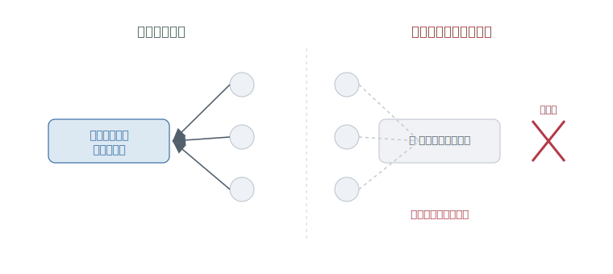
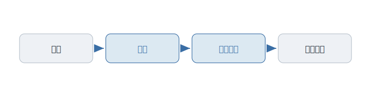

# 第5章 なぜ、他人にコードを見せるのか

「これ、レビューに出しておいてください」

そう言われて、あなたは少しためらう。コードは、もう動いている。テストも通っている。なのに、なぜ、わざわざ他人の目にさらすのか。

見せれば、粗が見つかる。「ここ、おかしくないですか」と言われる。せっかく書いたものに、赤い印が並んで返ってくる。動いているのに、わざわざ恥をかきにいくようなものではないか。

見せたくない。その気持ちの裏に、ひとつの落とし穴が隠れている。

---

ソフトウェアは、一人で抱えられるうちは、気楽だ。全部、自分の頭の中にある。どこに何があるか、なぜそう書いたか、聞かなくてもわかる。

だが、その「自分だけがわかる」状態には、値札がついている。

考えてみてほしい。決済まわりのコードを、たった一人が握っている。仕様も、癖も、落とし穴も、すべてその人の頭の中だけにある。チームは、何かあるたび「あの人に聞けばいい」で回している。

ある日、その人がいなくなる。転職でも、長い休みでも、理由は何でもいい。残されるのは、誰も中身を知らない、触れないコードの山だ。

<figure>

<figcaption><strong>図 5-1</strong>　一人に閉じた知識は、その人が抜けると誰も触れない。</figcaption>
</figure>

これが、プログラマーを縛ってきた、次の不自由だ。**一人が消えたら、誰も触れない。** しかも縛られているのは、残された側だけではない。握っている当人も、抜けられない。休めない。倒れられない。「あの人に聞けばいい」は、あの人を、逃げ場のない場所に閉じ込める呪いでもある。

---

最初の答えは、むしろ逆を向いていた。詳しい一人がいれば回るなら、**その一人に頼ればいい。**

エースに任せる。いちばん詳しい人間が、いちばん難しいところを抱える。チームは、その人を中心に組み立てられる。属人化は、避けるべき欠陥ではなく、頼れる強みだと思われていた。「あの人がいるから大丈夫」――それは、ほめ言葉ですらあった。

---

だが、その作り方は、たった一つの出来事で崩れる。**その一人が、いなくなったとき。**

引き継ぎ書を残していても、足りない。文書は、コードの「何を」は書けても、「なぜ」までは書ききれない。書いた本人にとって当たり前すぎたことは、そもそも書かれない。残るのは、動いてはいるが、誰も理由を説明できないコードだ。

「あの人に聞けばいい」は、あの人がいるあいだしか成り立たない。たった一人に知識を預けることは、その人を質に取られているのと変わらない。強みに見えていたものが、いちばんもろい一点だったと、いなくなってはじめて気づく。

---

ならば、どうするか。知識を、一人の頭に閉じ込めない。**書いている最中から、見せ合う。**

書きながら、二人で一つの画面に向かう。一人が書き、もう一人がその場で読む。書き上がったコードを、別の誰かの目に通してから取り込む。やり方はいろいろあるが、狙いは一つだ。**一人の頭の中にしかない知識を、外に出して、複数の人が触れる状態にする。**

この「見せ合い」を、一部の現場の作法から、世界中の当たり前へ押し広げた仕組みがある。**プルリクエスト**だ。

自分の変更を、いきなり本体に入れるのではなく、いったん「こう変えたいのですが、どうでしょう」と提案の形で差し出す。誰でもそれを読み、その場で意見を書き込み、納得してから取り込む。この一連の流れを、誰もが使える普通の手続きにした。見せ合うことは、特別な儀式ではなくなった。

<figure>

<figcaption><strong>図 5-2</strong>　変更を、いきなり本体に入れない。提案として差し出し、読んで、納得してから取り込む。コードを書いたら、人に見せる。それが、日常になった。</figcaption>
</figure>

---

ここで、少し考えてみてほしい。同じ一つの指摘を、二通りの言い方で書く。

- 「ここ、間違ってます。直してください。」
- 「ここ、こうするとどうでしょう？　もし意図があれば教えてください。」

どちらも、伝えている中身は同じだ。だが、受け取ったあなたは、次もコードを見せたくなるだろうか。前者を何度ももらえば、人は見せるのが怖くなる。後者なら、見せてよかったと思える。

この違いは、好みの問題ではない。**見せ合いの文化が続くかどうか**が、ここにかかっている。

---

だから今、レビューは、粗探しの品評会ではない。

ここで、ありがちな思い違いを正しておきたい。レビューとは、「相手のコードの欠点を、ひとつ残らず指摘すること」ではない。

すべての粗を並べ立て、優劣をつける場にした瞬間、人は見せるのをためらいはじめる。見せなくなれば、知識はまた一人の頭に閉じこもる。それでは、何のためのレビューかわからない。

レビューの目的は、相手を負かすことではない。コードを、**複数の人が触れる状態にする**ことだ。だから、致命的でない好みの違いは、ときに流す。理解を分け合うことを、粗探しより優先する。指摘の数ではなく、見せ合いが続くことを大事にする。

---

では、どこまでレビューすべきなのか。誰の承認があれば取り込んでいいのか。そして、その目をどこまで機械に任せられるのか。そこから先は、まだ決まっていない。

形式的な誤りは、機械が自動で見つけるようになった。最近では、人より先に道具が下読みをすることもある。それでも、「なぜこう書いたか」を分かち合う部分は、まだ人の手に残っている。どこまでを機械に渡し、どこからを人が担うか。その線引きは、いまも動いている。

ただ、こればかりは、もう揺るがない。コードは、一人の頭に閉じ込めない。書いたら、見せる。

---

あのためらいの正体が、これで見える。なぜ、動いているコードを、わざわざ他人に見せるのか。

見せるのは、欠点をさらすためではない。あなたの頭の中だけにある知識を、外に出して、チームの共有物にするためだ。そうすれば、あなたは安心して休める。倒れても、コードは生き続ける。誰かが辞めても、それは終わりではなくなる。

**レビューとは、コードを一人の記憶から解き放つ――という自由だ。**

---

### この章の手がかり

- 人: マイケル・ファガン（Michael E. Fagan）。レビューやインスペクションを、属人的な善意ではなく手法として整えた。
- 言葉: プルリクエスト。変更を提案として出し、読んで、話し合ってから取り込むための流れ。
- 次に読むなら: GitHub の Pull Requests の文書を見ると、この章の話がいまの開発現場でどう日常化しているかが見えやすい。

---

見せ合うことで、コードは、チームみんなのものになった。

だとしたら、その「みんな」を、もっと広げたら、どうなるだろう。会社の壁も、チームの境目も越えて、世界中の誰にでも、コードを見せてしまったら。

無料で公開して、いったい何の得があるのか。

その話は、次の章で。
