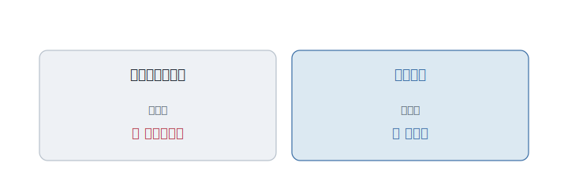
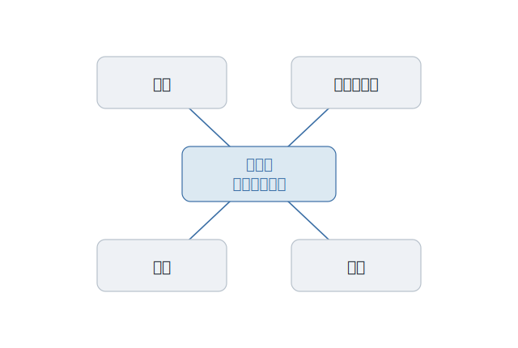
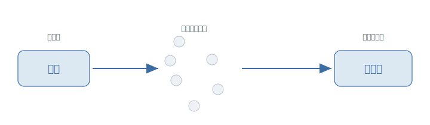

# 第6章 無料で公開して、何の得があるのか

ある研究所に、一台のプリンタがあった。

よく紙が詰まった。詰まっても、誰にも知らされない。みんな、印刷したつもりで席に戻り、しばらくして「まだ出てこない」と気づく。

そこにいた一人の技術者は、考えた。紙が詰まったら、使っている全員に知らせる。たったそれだけの仕組みを、自分で足せばいい。前に使っていた別のプリンタでは、実際にそうしていた。中の仕組みに、数行を書き足すだけのことだ。

だが、できなかった。新しいプリンタの中身――それを動かしているソフトは、外に公開されていなかった。読むことも、直すことも、許されていない。たった数行のために、彼は、作った会社が気が向くのを待つしかなかった。

彼は、納得がいかなかった。自分が毎日使う道具の中身を、なぜ、自分で直してはいけないのか。

---

この小さな出来事の中に、大きな不自由が畳み込まれている。

ソフトの中身が見られないと、使う人は、**作った者に従属する**しかない。困っても、自分では直せない。気に入らなくても、作り替えられない。会社が「もう売りません」と言えば、明日からそのソフトは、誰にも直せないまま死ぬ。あなたは、ただ待つ人になる。直す力も、学ぶ機会も、配る権利も、手元にはない。

これは、昔話ではない。中身を開けられない機械、勝手に修理してはいけない製品、契約で分解を禁じられたソフト。今のあなたの周りにも、同じ不自由は、いくらでもある。

---

この不自由は、長いあいだ、当たり前の商売の形でもあった。**ソフトの中身は、秘密にして売る。**

中身を見せれば、真似される。だから隠す。隠すことが、価値を守るのだと考えられた。ソフトを買うとは、動く結果だけを受け取ることで、中の仕組みは、作った会社だけのものだった。

理屈は通っている。だが、その当たり前は、使う人から力を奪っていた。バグを見つけても、報告して待つしかない。自分の仕事に合わせて少し変えたくても、手が出せない。会社の都合ひとつで、頼っていた道具が消える。使う人は、いつまでも、無力なままに置かれた。

<figure>

<figcaption><strong>図 6-2</strong>　中を閉じれば、直す力は作った会社に。中を開けば、その力は使う人の手に移る。</figcaption>
</figure>

---

ここで、さきほどの技術者が動く。**リチャード・ストールマン。**

彼は、こう考えた。ソフトを使う人には、本来、四つの当たり前の権利があるはずだ。**自分の目的で使う。中身を読んで学ぶ。直したいように直す。それを他人に配る。** 中を隠す商売は、この四つを、まとめて取り上げていた。彼は、それを取り戻そうとした。

<figure>

<figcaption><strong>図 6-1</strong>　使い、読み、直し、配る。四つの自由。</figcaption>
</figure>

そして、ひとつの宣言を書く。誰でも使え、誰でも中身を読め、誰でも直して配れる――そういうソフトを、自分たちの手で作り上げる、と。

ここで、言葉の取り違えを、一つ解いておきたい。彼が掲げたのは「フリーソフトウェア」だった。だが、この「フリー」は、**無料という意味ではない。自由、という意味だ。** 英語の free には、両方の意味がある。彼が言いたかったのは、値段が 0 円だということではなく、使う人が縛られていない、ということだった。**ただ酒のフリーではなく、言論のフリーだ**、と彼は繰り返した。

そしてこの一語こそ、この本がずっと追いかけてきたものだ。

---

ひとりの宣言は、思いがけない広がり方をした。

世界中の見知らぬ技術者たちが、自分の手元から少しずつ、部品を持ち寄りはじめた。やがて、その流れに、一人の学生が書いた中核部分が合流する。**リーナス・トーバルズ**――のちに、世界の大半のサーバーやスマートフォンの土台となる、あの基盤を書きはじめた人だ。誰のものでもないソフトが、本物の、実用に耐えるものとして組み上がっていった。

<figure>

<figcaption><strong>図 6-3</strong>　ひとりの宣言に、世界中の見知らぬ手が集まる。やがて、実用に耐えるソフトへ組み上がっていく。</figcaption>
</figure>

膨大な人数が、同じソフトに同時に手を入れる。その混乱を捌くために、トーバルズは、もう一つの道具まで作ってしまう。誰が、いつ、どこを変えたかを記録し、世界中の変更を安全に束ねる仕組みだ。いま、ほとんどのプログラマーが毎日使っている、あれである。

同じ考えは、コードの外へも漏れ出した。誰でも書き換えられる百科事典が、専門家が囲い込んだ百科事典を、いつのまにか追い抜いていた。中を開き、皆で直し、自由に配る。その形が、コードでないものまで作り替えていった。

---

だから今、世界の根幹は、こうして公開されたソフトの上で動いている。あなたが今日触れた技術の、見えないところのほとんどが、誰かが無償で公開したコードでできている。

ここで、よくある誤解を、二つ解いておきたい。

ひとつ。これは「タダ働き」や「趣味の善意」ではない。世界中の企業が、本業として、給料を払って、公開されるソフトに人を投じている。なぜか。土台を皆で共有したほうが、各社が秘密に抱えるより、結局みんなが速く進めるからだ。自由なソフトは、慈善ではなく、れっきとした戦略になった。

もうひとつ。さきほどの「フリー」だ。公開されているからといって、何でも 0 円で好き放題できる、という意味ではない。自由には、作法がある。直したものは同じように皆に開け、作った人の名は消すな――そうした約束の上で、自由は回っている。自由とは、無法とは違うのだ。

---

では、その自由を、どうやって支え続けるのか。そこから先は、まだ誰も答えを出していない。

世界が頼りきっている土台が、たった数人の、無償の善意で支えられている、ということが珍しくない。彼らが疲れ果てて手を引けば、世界が揺らぐ。タダで配るものに、どう報いるのか。自由を、誰が支えるのか。この問いは、いまも開いたままだ。

ただ、譲れない一線だけは、はっきりしている。使う人から、直す力を取り上げない。中を開き、皆で直し、自由に配る。

---

問いそのものに、戻ってみる。無料で公開して、何の得があるのか。

問いの立て方が、そもそも、ずれていた。彼らが手に入れようとしたのは、金銭の得ではない。あのプリンタの前で、一人の技術者が奪われていたものだ。**自分の使う道具の中身を、自分で開き、自分で直し、自分で配る。** その当たり前を、取り戻すこと。

**オープンソースとは、直し、見て、配る――その自由そのものだ。**

---

こうして、プログラマーたちは、自由に作り、自由に配れる世界を手に入れた。

ところが、その自由な世界の中で、彼らは、いつまでも言い争うのをやめない。この書き方か、あの書き方か。この道具か、あの道具か。決着がついたものもあれば、何十年も平行線のままのものもある。

なぜ、その議論は、終わらないのか。

その話は、次の章で。
