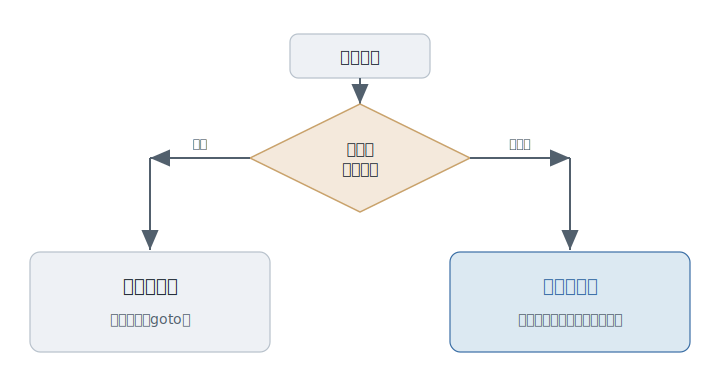

# 第7章 その議論は、なぜ終わらないのか

チャットが、燃えている。

きっかけは、ごく小さなことだった。インデントは、タブか、スペースか。たったそれだけの話に、何十件もの投稿が積み上がっている。大の大人が、本気で、一歩も譲らない。

あなたは、戸惑う。どちらでも、コードは動く。なのに、なぜ、こんなことで、こんなに揉めるのか。そして、もっと不思議なのは――この手の論争が、何年も、ときには何十年も、決着しないまま続いていることだ。

なぜ、その議論は、終わらないのか。

---

プログラマーには、ひとつの癖がある。**「正しい、たった一つの答え」を、探したがる。**

これは、悪い癖ではない。むしろ、ここまで見てきた多くの前進は、より良い一つを探す力から生まれた。だが、この癖には裏がある。**どんな問いにも唯一の正解があるはずだ、と思い込む**と、答えの出ない問いの前で、人は延々と争い続けることになる。

終わらない論争の正体は、たいていこれだ。**本来は決着のつかない問いを、決着がつくはずだと信じて、殴り合っている。** 唯一の正解という幻が、争う人々を、その場に縛りつけている。

これが、この部で向き合う不自由だ。**「正しい一つ」に、縛られる。**

---

最初の答えは、力ずくだった。決着がつかないなら、**誰かが「これが正解だ」と決めてしまえばいい。**

権威ある誰かが宣言する。あるいは、論争に勝ったほうが、唯一の正解の座につく。みんながそれに従えば、不毛な争いは終わる――そう考えられた。実際、プログラミングの歴史には、「これが絶対だ」という宣言が、いくつも刻まれている。

---

だが、その「唯一の正解」は、何度も裏切られた。

ある時代に「これしかない」とされた書き方が、文脈が変わったとたん、時代遅れになる。万能とされた道具が、別の現場ではまるで役に立たない。唯一の正解を立てるたびに、後になって、「あれは、ある条件の中での正解にすぎなかった」と判明する。これは、第1章で見た「銀の弾丸探し」の、別の顔だ。一つの答えですべてを片づけたい、という誘惑が、また顔を出している。

ここで、問いには二つの種類がある、と気づいた人たちがいた。

---

**閉じた問いと、開いた問い。** この二つを、分ける。

**閉じた問い**は、決着のついた問いだ。なぜ片方が残ったのかを、はっきり語れる。

たとえば、かつて、プログラムの流れをあちこちへ自由に飛ばす書き方をめぐって、大きな論争があった。エドガー・ダイクストラ（Edsger W. Dijkstra）――テストの章でも顔を出した、計算機科学者の一人だ――は、その自由な飛び方が、コードを誰にも追えない迷路にする、と論じた。流れを、決まった形の積み重ねだけで書こう、と。この論争には、勝者がいる。今、彼の言うとおりの書き方が、当たり前になっている。これは、閉じた問いだ。

**開いた問い**は、決着のつかない問いだ。どちらにも、ちゃんとした理由がある。だから、勝ち負けを書けない。

たとえば、型のあるなしをめぐる長い論争。書くときの安全を取るか、書くときの身軽さを取るか。どちらにも、確かな言い分がある。これは、何十年経っても決着していないし、おそらくこれからも決着しない。タブかスペースか、も、この仲間だ。

<figure>

<figcaption><strong>図 7-1</strong>　勝者を語れるかで、問いは二種類に分かれる。</figcaption>
</figure>

---

ここで、少し仕分けをしてみてほしい。

世の中で繰り返されている論争を、いくつか思い浮かべる。そして、一つずつ、自分に問う。これは、勝者を語れる**閉じた**問いか。それとも、どちらにも理由がある**開いた**問いか。

最初の数件は、迷うはずだ。だが、この「どちらの種類の問いなのか」を、議論を始める前に見分けられるようになると、世界が変わる。閉じた問いなら、答えを学べばいい。開いた問いなら――勝とうとするのをやめて、選び方を考えればいい。

---

だから今、成熟したプログラマーは、論争に飛び込む前に、まずその種類を見分ける。

ここで、いちばん大事な誤解を解いておきたい。「正解はない」とは、「**どっちでもいい**」という意味ではない。

開いた問いに決着がつかないからといって、何でもありになるわけではない。「全部アリ」は、考えるのをやめた人の言葉だ。閉じた問いには、ちゃんと答えがある。学ばずに「人それぞれ」で済ませれば、ただの怠慢だ。そして開いた問いでさえ、「この場面では、こちらの理由が勝つから、こちらを選ぶ」と、根拠を持って選べる。

「正解はない」とは、投げ出すことではない。**唯一の正解という幻に縛られるのをやめて、自分の文脈で選ぶ責任を、引き受けること**だ。

---

では、どの問いが、いつか閉じるのか。それは、誰にもわからない。

今は開いている問いが、未来に決着するかもしれない。逆に、閉じたと思われた問いが、新しい文脈で、もう一度開くこともある。問いの仕分けそのものが、永遠に更新され続ける。だから、この見分けに、最終版はない。

ただ、一つの構えだけは、変わらない。すべての問いに唯一の正解がある、とは考えない。

---

では、冒頭の炎上に戻ろう。なぜ、その議論は終わらないのか。

終わらない議論は、たいてい、開いた問いを閉じようとしているからだ。どちらにも理由があるものに、無理やり唯一の正解を立てようとするから、永遠に殴り合うことになる。

種類さえ見分ければ、あなたは、その消耗から降りられる。勝ち負けではなく、選び方の話を始められる。

**「正解はない」とは、選ぶ自由を手放さない、という積極的な答えだ。**

---

### この章の手がかり

- 人: エドガー・ダイクストラ（Edsger W. Dijkstra）。すべての議論を終わらせた人ではないが、「決着がつく問い」の例をはっきり残した。
- 言葉: 閉じた問い / 開いた問い。この章の造語ではなく、本書で議論を整理するための見取り図だと考えると使いやすい。
- 次に読むなら: 身近な論争を一つ選び、それが閉じた問いか開いた問いかを自分で仕分けしてみると、この章は急に実感に変わる。

---

開いた問いの、最たるものがある。**どの言語で書くか**、だ。

言語は、ただの道具ではない。何を簡単にし、何を難しくするかで、書く人の考え方そのものを、静かに形づくる。

では、用意された言語の、どれもが気に入らなかったら――人は、どうするのか。

その話は、次の章で。
