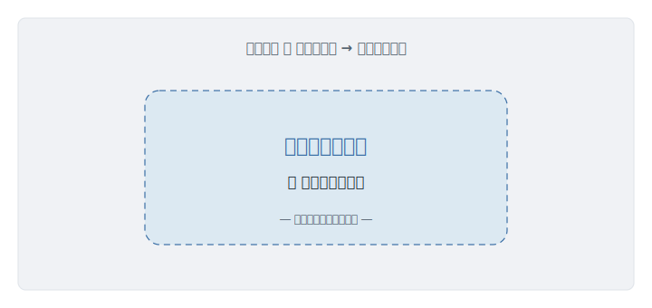
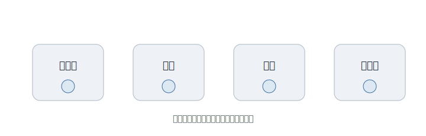

# 第8章 言語をつくる、という選択

「自分で、プログラミング言語を作った人がいるんですよ」

そう聞いて、あなたは、ちょっと驚く。世界には、もう数えきれないほどの言語がある。なぜ、わざわざ、もう一つ増やすのか。車輪を、もう一度発明するようなものではないか。

だが、その「もう一つ」が、あなたが今、毎日書いている言語かもしれない。誰かが、ありものに満足できず、ゼロから作ったもの。その人は、いったい、何が気に入らなかったのか。

---

まず、見落とされがちなことがある。**言語は、ただの道具ではない。書く人の考え方そのものを、静かに形づくる。**

どんな言語も、あることを簡単にし、別のことを難しくする。そして、難しいことは、だんだん「やらなくなる」。やらないうちに、やがて「思いつきもしなくなる」。気づけば、人は、その言語が許すことの範囲でしか、ものを考えられなくなっている。

これは、自分では気づきにくい。檻の中にいる者には、檻の外が見えない。もっと楽に書ける世界があると知らなければ、今の不便を、不便とすら感じない。「プログラミングとは、こういうものだ」と思い込む。

<figure>

<figcaption><strong>図 8-1</strong>　言語が難しくすることは、やがて思いつかなくなる。</figcaption>
</figure>

これが、この章の不自由だ。**言語が許すことしか、考えられない。**

---

最初の答えは、まっとうだった。ありものの中から、**いちばんマシなものを選ぶ。**

速いから、これにしよう。みんなが使っているから、これにしよう。仕事で求められるから、これにしよう。世にある選択肢を見比べて、その中の一つに決める。賢い選び方だ。

---

だが、どれを選んでも、ひとつ、ついて回るものがある。**その言語を作った人の価値観だ。**

速さを何より優先して作られた言語は、書く人に、こまごました我慢を強いる。理論的な正しさを突き詰めた言語は、近寄りがたい。流行で選んだ言語が、自分の作りたいものと、根っこのところで噛み合わないこともある。

選んでいるつもりで、実は、選ばされている。誰かの価値観が染み込んだ道具に、こちらの考え方を、合わせ続けている。ありものから選ぶかぎり、その誰かの価値観からは、逃げられない。

---

ここで、まったく別の基準を持ち込んだ人がいる。**まつもとゆきひろ（Matz）** だ。FjordBootCamp で多くの受講生が触れる **Ruby** を作った人でもある。

彼が Ruby を作るとき、第一に置いたのは、速さではなかった。理論的な美しさでもなかった。**書く人が、楽しいこと。** ただ、それだった。

奇妙に聞こえるかもしれない。道具を作るのに、性能でも正しさでもなく、「楽しさ」を中心に据える。だが、彼の理屈は、筋が通っていた。**道具は、人間のためにある。** ならば、人間が道具に我慢するのは、おかしい。書いていて気持ちがいい、書いていて嬉しい――そういう言語があっていいはずだ。Matz は、人間が機械に歩み寄るのではなく、機械を人間のほうへ引き寄せようとした。

これは、彼ひとりの考え方ではない。言語を作る人は、それぞれの価値観を、道具に込める。一つのことを、いろんなやり方で書ける自由を大事にした人。逆に、誰が書いても同じ形になる素直さを選んだ人。読みやすさを、何よりも上に置いた人。**言語の数だけ、「何を大事にするか」の答えがある。**

---

だから今、言語は、性能の順位表ではない。価値観の、見本市だ。

<figure>

<figcaption><strong>図 8-2</strong>　言語は、性能の順位表ではない。大事にするものの数だけ、言語がある。</figcaption>
</figure>

ここで、しばしばある誤解を解いておきたい。言語を選ぶこと、まして作ることは、「速いから」「流行っているから」で決まる話ではない。

速さは、たしかに大事だ。だが、それは数ある価値観の、一つにすぎない。速さのために何を捨てるか、捨てないか――そこにこそ、その言語の思想が出る。流行も同じだ。なぜ流行ったのかをたどれば、たいてい、多くの人の価値観に響く「何か」がそこにある。性能の数字や流行の波だけを見て選ぶのは、いちばん大事なところを見落としている。

問うべきは、「速いか」ではない。「**自分は、何を大事にしたいのか**」だ。

---

では、どんな価値観の言語が、いちばん良いのか。それは、答えの出ない問いだ。

前の章の言葉でいえば、これは「開いた問い」だ。楽しさか、速さか、安全か、素直さか。言語に優劣をつけられないのは、価値観に優劣をつけられないのと、同じことだ。だから、言語をめぐる論争も、終わらない。終わらなくて、いい。

ただ、芯だけは、ぶれない。道具に、人間が合わせるのではない。人間の価値観に合わせて、道具のほうを、選び直す。

---

最初の驚きに、戻ろう。なぜ、わざわざ、新しい言語を作るのか。

ありものが気に入らなかったからだ。正確に言えば、ありものに染み込んだ価値観に、従いたくなかったからだ。彼らは、与えられた檻の中で我慢する代わりに、自分の大事にするものを中心に、道具そのものを作り直した。

言語を作るとは、究極の「選び直し」だ。何を簡単にし、何を大事にするかを、自分で決める。

**言語をつくるとは、自分の価値観で、道具を選び直す自由だ。**

---

### この章の手がかり

- 人: まつもとゆきひろ（Matz）。Ruby を通じて、「楽しさ」を言語設計の中心に置いた。
- 言葉: 言語設計。速さや流行だけでなく、「何を簡単にし、何を難しくするか」を決める営み。
- 次に読むなら: Ruby を使わない読者でも、他の好きな言語を一つ選び、「その言語は何を大事にしていそうか」を考えると、この章が自分の話になる。

---

こうして、人は、自分の価値観で道具を作り直せるようになった。

だが、作っただけでは、誰にも届かない。作ったものを、世界中の人の手元へ運ぶには、また別の壁がある。どの会社の許可も、どの機械の都合も超えて、作ったものを、いきなり世界へ送り出す。

そんなことが、どうして可能になったのか。

その話は、次の章で。
