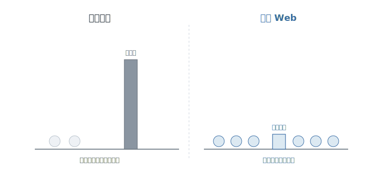
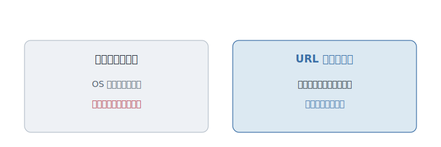

# 第9章 Web だけが、世界を覆った

あなたは、作ったものを、友達に見せたい。

「URL ちょうだい」と言われて、リンクを一つ送る。それだけだ。相手は、何もインストールしない。Windows でも、Mac でも、手元のスマートフォンでも、リンクを開いた瞬間に、あなたの作ったものが動きだす。

あまりに当たり前で、すごさに気づかない。だが、少し前まで、これは魔法のような話だった。作ったものを、世界中の、どんな機械を使っている誰にでも、許可も審査もなしに、一瞬で届ける。なぜ、Web だけが、こんなことを可能にしたのか。

---

かつて、作ったものを人に届けるのは、途方もない難事業だった。

機械の種類ごとに、作り直す。この OS 用、あの OS 用、と何通りも用意する。そして、配る道は、たいてい誰かに握られていた。プラットフォームの持ち主が「うちでは配らせない」と言えば、それで終わり。どれだけ良いものを作っても、届けるかどうかの最後の鍵は、作り手ではなく、別の誰かが持っていた。

これが、最後の不自由だ。**機械や、配る場所の持ち主に縛られて、作ったものが、届かない。**

---

1990 年代、最初の答えは壮大だった。バラバラな機械やソフトを、**一つの完璧な共通規格で、統一してしまえ。** その象徴の一つが、**CORBA（Common Object Request Broker Architecture）** だった。

世界中のあらゆるシステムが、同じ精密な作法でつながる。そういう、分厚くて、厳密で、隙のない標準が設計された。きっちり決めきれば、何でも、何とでもつながるはずだ――そう信じられた。一流の頭脳と、大企業の連合が、本気でそれに取り組んだ。

---

だが、その重い標準は、広く使われるには、**重すぎた。**

仕様は、分厚かった。読みこなすだけで一苦労だ。きちんと動かすには高価な道具が要り、扱える技術者は限られた。完璧を目指した精密さが、そのまま、参加の高い壁になった。少数の大組織は使えても、世界中の名もない作り手には、手が出せない。

ここに、この章の影の主役がいる。**完璧を目指して、重くなりすぎたもの。** それは立派な設計だった。だが、立派さは、普及とは別のことだった。誰もが参加できなければ、世界は覆えない。

<figure>

<figcaption><strong>図 9-1</strong>　重さは、参加の壁だった。</figcaption>
</figure>

---

世界を覆ったのは、その正反対だった。**ゆるく、軽く、つなぐ。**

1990 年代初め、Web は、拍子抜けするほど単純な仕組みで始まった。文書に少しだけ印をつける書き方――**HTML（HyperText Markup Language）**。その文書を「ください」と頼んで受け取るだけの、素朴な約束ごと――**HTTP（Hypertext Transfer Protocol）**。そして、受け取った文書を映す窓――ブラウザ。どれも、厳密とはほど遠い。多少いいかげんでも、動く。だからこそ、誰でも参加できた。

やりとりの作法でも、軽いほうが広く浸透した。重厚な手続きを踏ませる方式は、結局、あの分厚い標準と同じ悩みを抱えやすかった。代わりに広まったのは、**REST（Representational State Transfer）** に象徴される、「ものごとに住所を与えて、その住所へ取りに行く」という、あっけないほど素朴なやり方だった。

決定的だったのは、これらが、誰か一社の持ち物ではなかったことだ。仕様は公開され、誰のものでもなかった。だから、どの会社のブラウザも、どの言語も、許可を求めずに参加できた。1990 年代半ばには、ページを動かすための **JavaScript** が乗り、2000 年代になると、それを楽に作るための土台として **Ruby on Rails** のようなフレームワークも積み重なっていった。土台は、すべて、あの「ゆるく、軽く、公開する」の上にある。

---

だから今、あなたは、URL 一つで世界に届く。誰の許可も、いらない。

<figure>

<figcaption><strong>図 9-2</strong>　作り直して配れば、鍵は他人が握る。URL 一つなら、許可はいらない。</figcaption>
</figure>

ここで、繰り返し現れる誤解を解いておきたい。新しい技術が出てくるたびに頭をもたげる、あの誘惑だ。「これからは、Web は全部、こう作るべきだ」――たとえば、ページを切り替えず、一枚の画面で全部こなす作り方を、唯一の正解のように掲げる。

だが、思い出してほしい。Web を強くしたのは、軽さと、ゆるさと、誰でも参加できることだった。何でもかんでも一つの重厚なやり方に寄せれば、その軽さを、自分から手放すことになる。それは、かつて重い標準が抱えた難しさを、別の形で呼び戻すことにもなりうる。

新しい技術を「唯一の正解」に祭り上げたくなったら、[第7章](chapter7.md)を思い出すといい。それが閉じた問いなのか、開いた問いなのか。たいていは、開いている。そして開いた問いに唯一の正解を立てようとするのは、[第1章](../part1/chapter1.md)で見た、銀の弾丸探しの、いちばん新しい姿だ。

---

では、Web は、どこまで重くなっていいのか。そこから先は、まだ誰も答えを出していない。

軽さで世界を覆ったはずの Web は、年々、重くなっている。豊かになった、とも言えるし、勝った理由を手放しつつある、とも言える。どこまでが進歩で、どこからが逆戻りなのか。この問いは、今まさに、開いたままだ。

ただ、これだけは、動かない。届ける力を、誰か一人の持ち主に、握らせない。

---

では、初めの問いに答えよう。なぜ、Web だけが、世界を覆ったのか。

完璧だったからではない。むしろ、逆だ。ゆるくて、軽くて、誰のものでもなかったから、誰もが参加できた。完璧で重い標準が広く届かなかった場所へ、不完全でも軽い Web は、するりと入り込んだ。

そうして、作る人は、ついに、届ける力まで手に入れた。どの会社の許可も、どの機械の都合も超えて、作ったものを、まっすぐ世界へ送り出せる。

**Web とは、誰の許可もなく、作って届けられる自由だ。**

ティム・バーナーズ＝リー（Tim Berners-Lee）やロイ・フィールディング（Roy T. Fielding）が形にしたのも、その公開性と軽さだった。HTML、HTTP、REST のような言葉を全部厳密に覚えなくても、「公開された単純な約束ごと」が広がりを作ったと掴めれば、まずは十分だ。綴りや違いを自分でも辿りたくなったら、用語集で HTML、HTTP、REST、CORBA を見比べてからこの章を読み返すと、対比がかなり見えやすくなる。

ここまで、九つの不自由と、九つの自由を見てきた。

複雑さに飲まれない自由。読まれる自由。変えられる自由。触れ続けられる自由。一人に縛られない自由。直し、見て、配る自由。選び続ける自由。価値観で道具を作り直す自由。許可なく届ける自由。

どれも、最初からあったものではない。誰かが不自由に気づき、本気で間違え、議論し、少しずつ勝ち取ってきたものだ。

その営みは、まだ終わっていない。そして今、その営みに、新しい書き手が加わろうとしている。コードを、人と同じように書く存在が。

最後に、一つだけ、問いが残る。

その話は、[終章](../epilogue.md)で。

## 参考文献

- [Tim Berners-Lee, *Weaving the Web*](https://www.harpercollins.com/products/weaving-the-web-tim-berners-lee)
- [Roy T. Fielding, *Architectural Styles and the Design of Network-based Software Architectures*](https://ics.uci.edu/~fielding/pubs/dissertation/top.htm)
- [Martin Kleppmann, *Designing Data-Intensive Applications*](https://dataintensive.net/)
