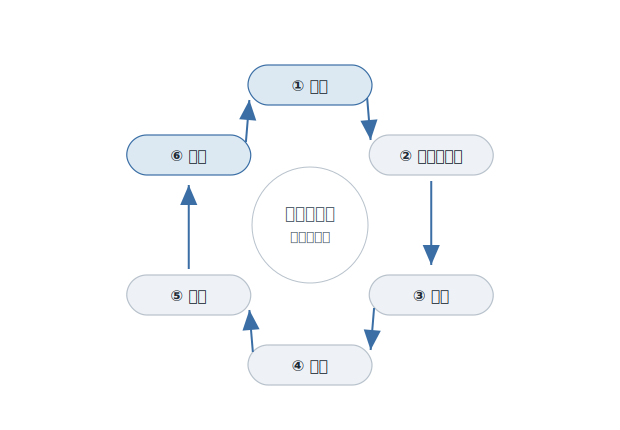
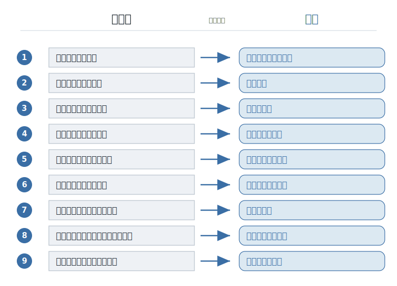

# はじめに ──「常識」は、最初から常識ではなかった

シンプルに書こう。テストを書こう。コメントより、まず名前を考えよう。コードは、人に見せよう。

プログラミングを学びはじめると、こうした言葉に、次々と出会う。先輩が言う。本に書いてある。研修で教わる。どれも、もっともらしい。そういうものか、と受け入れて、あなたは従う。

だが、ふと思う。これは、誰が決めたのだろう。

どこかの偉い人が、ある日「こう書きなさい」と定めたわけではない。これらの「当たり前」は、最初から当たり前だったわけではないのだ。誰かが困り、答えを出し、その答えで盛大に失敗し、言い争い、少しずつ直してきた。その長い積み重ねの果てに、いつのまにか「当たり前」になった。**常識は、生まれたときから常識だったのではなく、常識になったのだ。**

<figure>

<figcaption><strong>図 0-2</strong>　どの物語も、六つの拍子で回る。</figcaption>
</figure>

---

この本は、その「当たり前」が、どうやって当たり前になったのかを語る。

ただし、「正しい開発手法のカタログ」としては書かない。「こう書くのが正解です」と並べる本は、すでにたくさんある。この本が描くのは、もっと手前の話だ。プログラマーたちが、何に困り、何と戦い、何を手に入れてきたのか。その物語のほうだ。

そして、この物語には、一本の背骨がある。**不自由と、自由だ。**

プログラマーは、ずっと、いくつもの不自由に縛られてきた。たとえば――複雑さに飲み込まれる。半年後の自分にすら、コードが読めない。仕様が変われば、動けなくなる。一人が抜ければ、誰も触れない。道具の中身を、勝手に直せない。こうした不自由は、まだまだある。そして本書で語る「当たり前」は、どれも、その一つひとつに対して、プログラマーたちが勝ち取ってきた、別々の自由なのだ。

だから本書は、九つの不自由をめぐる、九つの物語でできている。それぞれの章で、一つの不自由が立ちはだかり、最初の答えが試され、手痛く失敗し、新しい考えが生まれ、やがて「当たり前」になる。そして、まだ終わっていない問いが、次の章へと続いていく。

<figure>

<figcaption><strong>図 0-1</strong>　九つの不自由と、九つの自由。本書の地図。</figcaption>
</figure>

---

読み終えたとき、あなたに残ってほしいのは、知識ではない。

「なるほど、そういう理由でそう考えるのか」と、外から納得して終わってほしくない。そうではなく、こう感じてほしい。**自分もこれから、そう考える側になっていくのかもしれない、と。**

なぜなら、この物語は、まだ続いているからだ。当たり前は、今も作られ続けている。そしてその作り手の列に、これからあなたも加わる。

これは、技術の解説書ではない。プログラマーという人たちが、何を大事にし、なぜそう考えるようになったのかを語る、**ソフトウェア文化への入門書**だ。

この本は、プログラミングスクール FjordBootCamp（フィヨルドブートキャンプ）の教材として作った。これからプログラマーになる人、なったばかりの人に向けて書いている。覚えてほしいのは、個々のやり方ではない。「なぜ、そう考えるのか」をたどる、その考え方のほうだ。

では、最初の不自由から始めよう。それは、ある日あなたが「便利な機能を足しましょう」と言ったときに、先輩が見せた、あの渋い顔の話だ。
